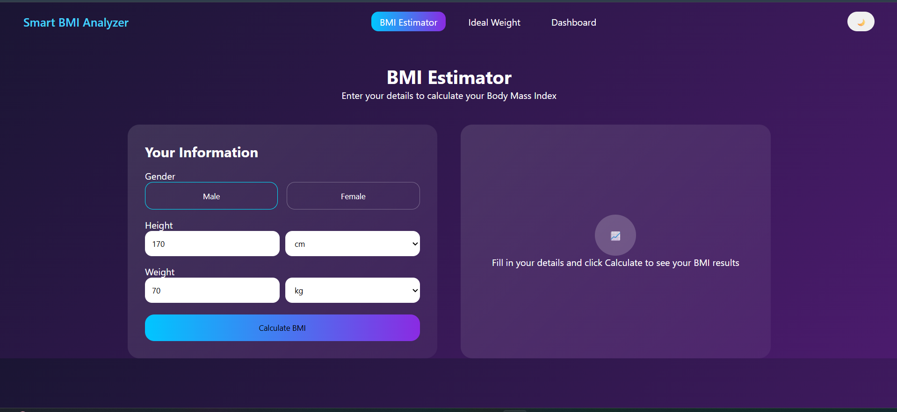
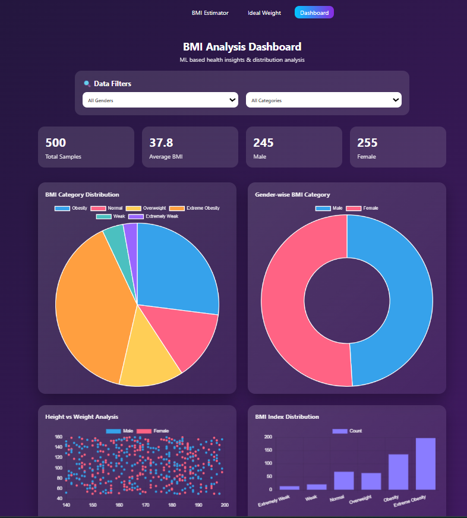

Estimate BMI Using Gender, Height & Weight (Machine Learning)

An AI-based system to estimate Body Mass Index (BMI) using Machine Learning.
The application provides BMI prediction, category classification, and an interactive user interface for analysis.

------------------------------------------------------------

Features

- BMI prediction using Gender, Height and Weight
- Machine Learning based classification
- BMI category detection (Underweight, Normal, Overweight, Obese)
- Interactive web interface
- Ideal weight analysis
- Dashboard visualization

------------------------------------------------------------

AI / ML Used

- Data preprocessing using Pandas
- Feature encoding
- Classification / Regression model
- Model training and prediction using scikit-learn

------------------------------------------------------------

Tech Stack

Python
Flask
scikit-learn
Pandas
HTML
CSS
JavaScript

------------------------------------------------------------

How to Run

Go to project folder
cd backend

Run the application
python app.py

Open in browser
http://127.0.0.1:5000

Or use Live Server for frontend pages

------------------------------------------------------------

Project Screenshots

<h3>Get Started Page</h3>

<h3>BMI Page</h3>

<h3>BMI Estimator</h3>

<h3>Ideal BMI Page</h3>

<h3>Ideal Weight Page</h3>

<h3>Dashboard</h3>

------------------------------------------------------------

Developed by Tamanna